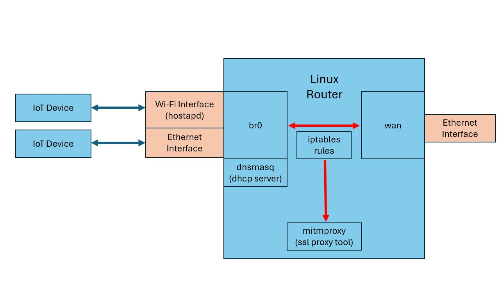

# mitmrouter
Scripts to automate traffic network interception, useful for IoT device traffic analysis and SSL MITM (Man-in-the-Middle) attacks.



## Dependencies

- hostapd
- dnsmasq
- bridge-utils
    - provides `brctl`
- net-tools
    - provides `ifconfig`

## Pre-requisites

You may want to disable NetworkManager from managing the Wi-Fi interface that will be used for the access point. To do so, add the following lines to `/etc/NetworkManager/NetworkManager.conf`:

```
[keyfile]
unmanaged-devices=interface-name:wlp4s0
```

Replace `wlp4s0` with the name of your Wi-Fi interface.


## Usage

Before running the script, edit the bash variables at the top of the script to match your machine's interface names and any other details you may want to change, such as the Wi-Fi network SSID and password.

The `./mitmrouter.sh up` command will bring the mitm router network up

The `./mitmrouter.sh down` command will bring down all the mitm router components


### sslproxy

This script uses sslstrip or mitmproxy to start an interception proxy for HTTPS requests.
The success of this depends on how the device is handling TLS communication. If the device is actually validating the SSL certificate, this attack won't work. However, a good percentage of devices do not check for the certificate and trust anything that they're presented with.

If the traffic cannot be decrypted correctly, you can comment this line in mitm.sh:
```
sudo iptables -t nat -A PREROUTING -i $BR_IFACE -p tcp --dport 443 -j REDIRECT --to-ports $SSL_PORT
```

When commented, you'll still be able to view the rest of the traffic in Wireshark and HTTPS traffic will work correctly, but encrypted.

### Credits

Adapted from [Matt's mitmrouter](https://github.com/nmatt0/mitmrouter). Respect !